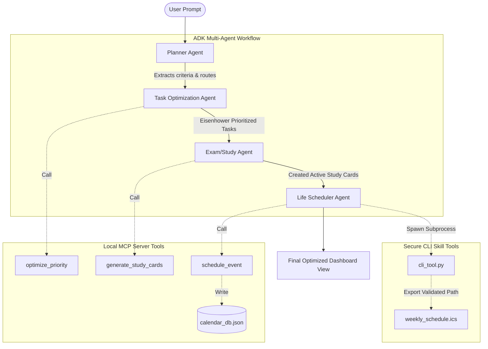

<<<<<<< HEAD
# OmniPilot-AI
=======
# OmniPilot AI — Full-Stack Multi-Agent Workspace

OmniPilot AI is an offline-first, full-stack multi-agent planner and scheduler. Built using Google's **Agent Development Kit (ADK)** workflow graph principles and **Model Context Protocol (MCP)** server patterns, it coordinates four distinct specialized agents to generate balanced, conflict-resolved study, work, and life calendars.

The entire system is designed to run **100% offline**, requiring no external API endpoints or developer keys.

---

## System Architecture



---

## 4 Key Concepts Implemented

1. **ADK Multi-Agent System**:
   - `PlannerAgent`: Parses parameters and coordinates the flow pipeline.
   - `TaskOptimizationAgent`: Evaluates urgencies and importance weights.
   - `ExamStudyAgent`: Establishes active recall modules and mock decks.
   - `LifeSchedulerAgent`: Computes calendar dates and resolves time collisions.
   - All coordinated via sequential node graph states (`START -> Planner -> Optimizer -> Study -> Scheduler -> END`).

2. **MCP Server Architecture**:
   - Exposes standard Model Context Protocol schemas for tools.
   - Hosts `schedule_event`, `optimize_priority`, and `generate_study_cards` tools locally over structured JSON-RPC payloads.

3. **Security Architecture**:
   - **Path Traversal Shield**: Verifies that any file write action (ICS export, markdown generation) resides strictly inside the `C:\Capston Project` workspace. Reject paths referencing parent directories (`..`).
   - **Subprocess Sanitization**: Sanitizes user strings passed as options to shell commands, restricting arguments to safe patterns.
   - **Input Length Boundary**: Imposes strict boundaries on user query length (max 1,000 characters) and sweeps html-like tags.
   - **Subprocess Isolation**: Runs CLI tasks via safe subprocess handles with strict timeouts.

4. **Agent Skills / CLI Tools**:
   - Implements `cli_tool.py` (`omnipilot-cli`) to export events to `.ics` calendar formats and compile topic overviews to clean Markdown. Called directly from backend workflow nodes.

---

## Installation & Setup

1. **Ensure Python 3.13** is installed.
2. Clone this repository to `C:\Capston Project`.
3. Open your terminal in the workspace and install requirements:
   ```bash
   pip install -r requirements.txt
   ```
4. Start the application:
   ```bash
   python -m uvicorn server:app --host 127.0.0.1 --port 3000
   ```
5. Navigate to `http://localhost:3000` in your web browser.

---

## End-to-End Demo Walkthrough

1. **Initiate Request**:
   - On the **Dashboard**, scroll to "Quick Orchestration" and click a sample prompt, e.g., *"I have a chemistry exam next Friday, block out organic equations study sessions and schedule my gym slots."*
   
2. **Observe Graph Transitions**:
   - Watch the **ADK Multi-Agent Graph Compilation** panel. The nodes light up dynamically as execution shifts:
     - `START` lights green.
     - `PlannerAgent` pulses orange during query parsing.
     - `TaskOptimizer` runs and calls the local `optimize_priority` MCP tool.
     - `ExamStudy` generates study blocks and active recall decks.
     - `LifeScheduler` checks for overlaps and writes events to `calendar_db.json`.
     - Node status completes at `END`.

3. **Browse Logs**:
   - In the **Multi-Agent Chat** tab, view the live dialogue bubbles from the agents explaining their steps.
   - Open the **Collapsible JSON payloads** in the right-side logs to see the precise JSON-RPC MCP requests and responses.

4. **Examine Timeline**:
   - Navigate to **Timelines & Calendar**. The grid displays the scheduled study and gym blocks.
   - Click the **Export ICS File** button. This spawns the CLI subprocess safely, writes a `weekly_schedule.ics` file, and displays a link to download it directly into your local calendar client.
>>>>>>> 80f2999 (Initial commit - OmniPilot AI)
